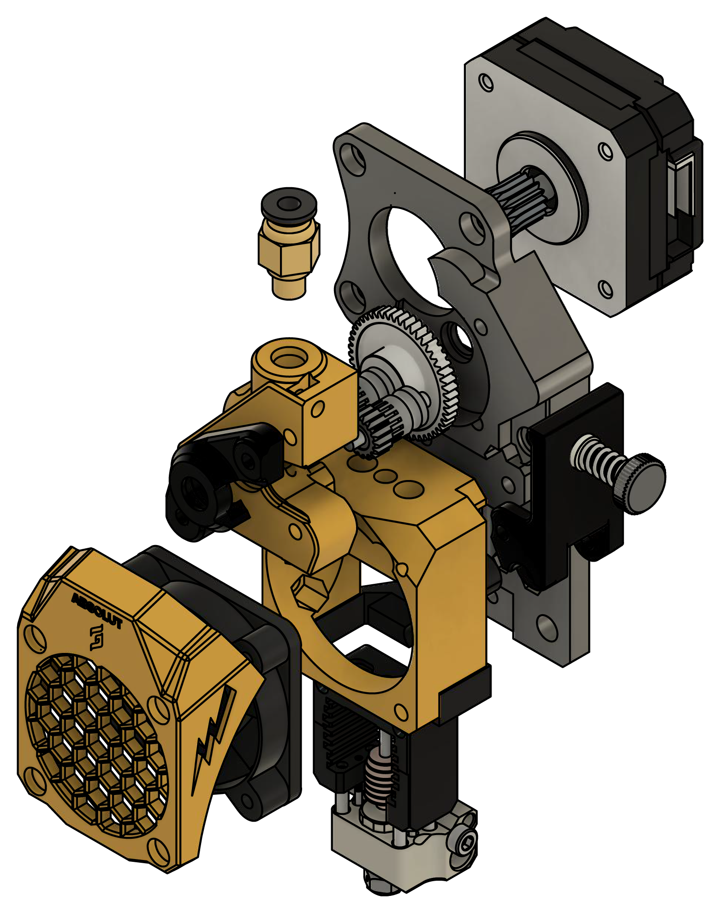
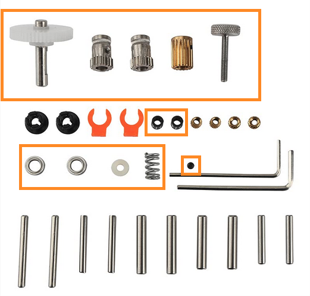
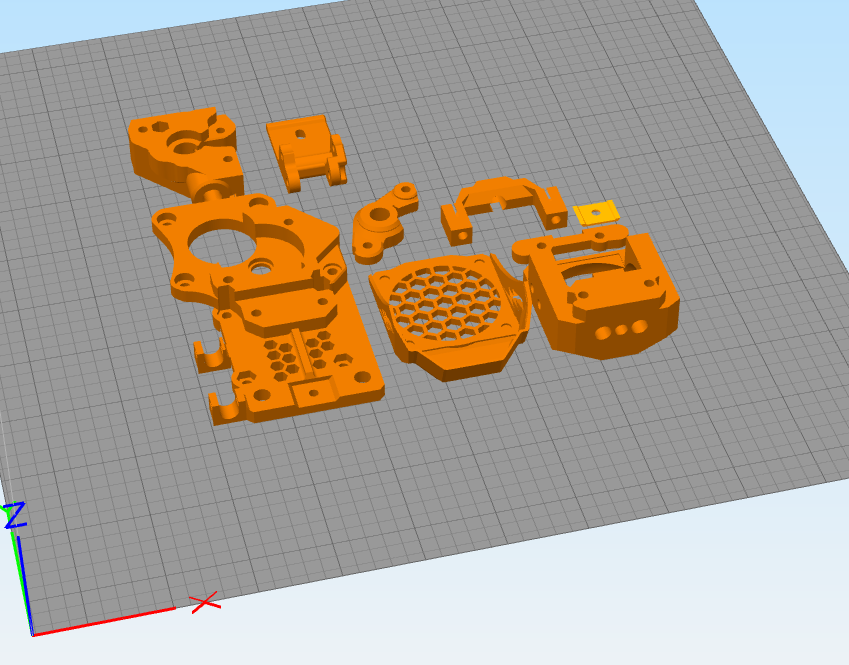

# ABSolut EVA x BMGee Mosquito Extruder

Was looking for a reliable toolhead for printing consistently in ABS. I then found the [HX Extruder for EVA system](https://www.thingiverse.com/thing:4968405) by [Threewheelz](https://www.thingiverse.com/Threewheelz) and modded it to function with my XChange Quick-Change Tool System and a Mosquito Hotend. <br/>

<strong><span style="color: yellow">Note:</span></span> I have only tested this with Klipper Firmware.</strong> <a href="#results">See my results</a>...



## Bill of Materials

This didn't require much. I'm pretty sure if you're a hobbyist, you'll have all the bolts you need lying around the shop!

<ol>
  <li>M3 socket head screws</li>
  <li>M3 nuts</li>
  <li>M3 locknuts</li>
  <li>Nema 17 Motor</li>
  <li>Pneumatic Fitting Push to Connect PC4-M6</li>
  <li><a href="https://amzn.to/3DqS01V">BMG Style Replacement Gear Kit</a></li>
</ol>

## BMG Style Replacement Gear Kit
 You'll find many of these online, but beware as some may have a thinner driver gear (4mm vs 3mm). You'll need all the parts highlighted below.

 

## Klipper Configuration

```conf
microsteps: 16
rotation_distance: 22.6789511
gear_ratio: 50:17
nozzle_diameter: 0.400
full_steps_per_rotation: 200
filament_diameter: 1.750
sensor_type: ATC Semitec 104GT-2
```

# Printing
<ul>
  <li>Print in ABS or PETG (depending on your setup)</li>
  <li>Print with supports (touching the build plate)</li>
  <li>.200 layer height</li>
  <li>Cooling Off</li>
  <li>60mm/s</li>
  <li>Infill 40%</li>
</ul>



## Results


